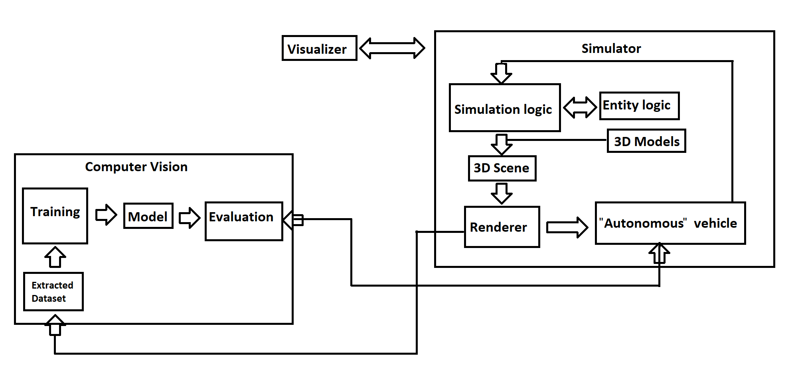

Weekend of 06/21/2025 project. Explores concepts related to self-driving cars in a simulated environment. Involves:
- Simulating the road, cars, and pedestrians
- Rendering 2d and 3d representations of the world using PyGame and OpenGL
- Extracting a dataset from the simulation, using it to train a convolutional neural network that can be used to control a car, then evaluating the qualitative performance of the network

An approximate system diagram is as follows:

There are some example videos in this repository:
- The 2d renderer: "2d simulation rendering.mp4"
- The 3d renderer: "3d simulation rendering.mp4"
- Examples of the car controlled by the neural network:
- With a smaller neural network and few samples: "car performance 1 - failure.mp4"
- With a slightly larger neural network, more samples, and some randomness introduced into the simulation: "car performance 2 - semi-successful.mp4"
- After training on more samples and adding dropout: "car performance 3 - mostly-successful.mp4"
- After more training epochs: "car performance 4 - successful.mp4"
